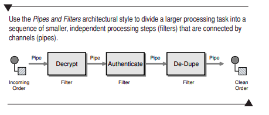

# Glossary: Message oriented middleware

<ul>
<li><i><b>asynchronously</b></i></li>
The reason why i just this word is because i personally believe, that this is one of the most fundamental concepts of message brokers / messaging systems, that also divides from a lot of the alternatives we can use, when we take about system design, and more specifically system integration.

The main difference between Http and message brokers (here we could take about a specific protocol like <i>ampq</i>, which is used in RabbitMQ for example), is that by default Http is <b>synchronous</b>, whereas message brokers are <b>asynchronous</b>.

There are both pros and cons with having a synchronous vs asynchronous communication.

Message Brokers are ideal for requests, that may take a longer time to process. Requests are stored, and if a server that handles the requests (also referred to as a <i> consumer </i>) goes down, the request is stored, and resumed, when the server is backup again. This is why it is ideal, for longer processing times.

<li><i><b>Transformation</b></i></li>
Transformation is a very important concept in message brokers and message oriented middleware. There are many different message brokers with many different philosofies on how to parse data.

We have larger and much more complex Message Broking systems like Apache Kafka, which not only provides a message broker, but provides an entire ecosystem with built in databases, orchestration and much more.

In contrast we have something like RabbitMQ, which is a more simple technology (in comparison to Kafka), they have a uniform format, where all message data is parsed to a byte array, when used.

<li><i><b>Message Channels</b></i></li>
In the paper this is described as <i> a virtual pipe that connects a sender to a receiver </i>. I like this description a lot, because it provides an anology of how a message channel works without describing any concrete details on how it is implemented in a specific Message Broker system.

The paper further elaborates on this description, and provides some more insight, and how it would work in a real life scenario, by describing

> <i>This is
> because the messaging system has different Message Channels for different
> types of information the applications want to communicate.</i>

<li><i><b>Sender / Receiver</b></i></li>
Also refered to as a <i>producer</i> and <i>consumer</i> and some cases. These terms define the system, that produces the request (producer), and the one the consumes them (consumer). This is a term, that is very oftens used in different system context,  very similar to client/server architechture when we talk about Web services.

 

<li><i><b>Channels are cheap, but they’re not free. </b></i></li>

This is more of a phrase than an actual word, but i chose it anyway. 
This is a very important point especially, when we are on the topic of scaling message brokers. So it is very cheap (in terms of computation to create a channel), but only up to a limit. 

If we have an example like LinkedIn (i use this as an example because they created Apache Kafka my favorite message broker), they might have different channels for different data we could have the following structure

<ol> Data Science:
<li> User messages </li>
<li> User jobs </li>
<li> User connections </li>
<li> User metadata
</ol>

<ol> Server API
<li> User messages </li>
<li> User jobs </li>
<li> User connections </li>
<li> User likes</li>
</ol>

We might have the "same" data used in multiple different formats across different services. 
In the above example we have different data for each user. A realistic scenario would be, that we have a Data Science platform, that needs the data in a special format (this could be references to database files, reference to csv files, or something else), whereas we have our Server API, where the data could be a different format. Even though the data is almost the same, the data type, performance, producer / consumer, pipes / filtering is all different for these two examples, and we might make a message channel for each "sub category" of data. 

This can quickly become expensive, and this is also one of the motivation factors for LinkedIn to create Apache Kafka (which is now a open source project maintained by Apache software foundation).

<li><i><b>Channel Names</b></i></li>

I think this is an important point. Like the old saying goes 

> <i>There are only two hard things in Computer Science: cache invalidation and naming things. </i>

This also goes for channels. As stated in the paper, there are different naming conventions aross multiple message brokers. The paper stats, the alphanumeric naming (also known as PascalCasing) should be used in most cases 
> Eg: <i>MyChannel</i>

<li><i><b>JMS</b></i></li>

JMS also known as <i> Java Messaging API </i> is an API, that provides a messaging standard, that allows Java Modules to communicate on the J2EE (Java Enterprise Edition), with out of the box features for creating, sending, reading and receiving messages. It is described as loosely coupled and reliable. In my opinion a great choice, for larger systems, that all run on the JVM (Java, Scala, Kotlin etc.)

In the paper code examples are provided using this api. 

<li><i><b>Message</b></i></li>

A message simple refers to a <i> pacakge of information </i> that is distributed between the sender and the receiver. 

A message concists of two parts 
<ul>
<li> Header </li>
<li> Body </li>
</ul>

While the Header contains some general information (metadata ) about the data, that is being transmitted, the body contains the actual data, that is being transmitted, which is generally ignored by the messaging system and simply transmitted as is. 

<li><i><b>Pipe and filters</b></i></li>

With Message Brokers a problem is introduced. The paper gives a number of examples for example, if messages contains sensitive information, we want to have some sort of security mechanism, that cheks that only trusedted parties can open and read a specific message. 

A Pipe is a form of middleware, that can ensure, that we a series of functions, that each message is passed through. 

When can use pipes as a kind of <i>middleware</i> to ensure, that we achieve the desireed functionality. 

We can implement this in seperate and independent components, to allow us to achieve a more decoupled architechture, because we can reuse our components across multiple <i> channels </i> and/or modules. 

At the same time we can take advantage of the asynchronous aspect of the message broker paradigm by ensuring, that the entire workflow is "non-blocking", what this means, is that, multiple messages, can be at different stages of the pipeline at the same time. We don't have to wait for each message to go through each step of our pipeline before we pass in a new message (see image for visualization).

